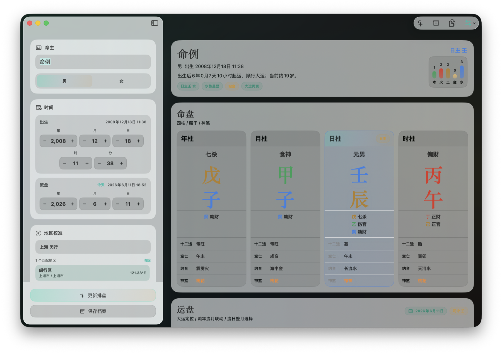

<p align="center">
  
</p>

<h1 align="center">BaziChart</h1>

<p align="center">
  A native, offline, privacy-first Bazi chart app for macOS.
</p>

<p align="center">
  <a href="README.md">简体中文</a>
  ·
  <a href="PRIVACY.md">Privacy</a>
  ·
  <a href="CONTRIBUTING.md">Contributing</a>
</p>

<p align="center">
  
  
  
  
</p>



BaziChart keeps the Four Pillars, Ten Gods, hidden stems, Twelve Stages, void branches, Na Yin and selected Shen Sha in one workspace. Luck pillars, annual, monthly and daily flows form a continuous timeline instead of a stack of disconnected pages.

No account. No cloud service. No analytics. Open the app and calculate locally.

## Highlights

- **Native macOS interface** built in SwiftUI, with keyboard shortcuts, system materials and a desktop-first layout.
- **Fully offline calculation** with no remote API or runtime network dependency.
- **True solar time correction** using longitude and the equation of time, with a clear Beijing-time comparison.
- **Built-in district search** covering Chinese provinces, cities and counties, including administrative code lookup.
- **Connected flow timeline** from ten-year luck pillars down to individual days.
- **Local profiles** for saving, searching and reopening frequently used charts.
- **Transparent output** that names the calendar engine and calculation parameters used.
- **Reproducible core cases** checked by automated tests.

## Feature Map

| Area | Included |
| --- | --- |
| Natal chart | Four Pillars, Ten Gods, hidden stems, Twelve Stages, void branches, Na Yin, Shen Sha |
| Timeline | Luck pillars, annual, monthly and daily flows |
| Time | Birth date and time, target date, Asia/Shanghai calendar |
| Location | District search, custom longitude, true solar time |
| Elements | Day Master and Five Element balance |
| Profiles | Local save, search, load and delete |
| Export | Copy a complete structured text chart |

## Requirements

- macOS 26 Tahoe or later
- Apple Silicon Mac for the currently verified build
- Swift 6.2 when building from source

The current interface uses macOS 26 SwiftUI APIs and does not ship a legacy rendering path.
The source is not tied to a CPU architecture, but Intel builds require separate verification on an Intel toolchain with the macOS 26 SDK.

## Install

Download the `BaziChart-macOS-*.zip` archive matching your Mac from **Releases**, unzip it, and move the app to `/Applications`.

Community builds are currently unsigned. On first launch, macOS may ask you to confirm the app. In Finder, Control-click the app and choose **Open**. Only download builds from this repository's Releases page.

### Build From Source

After cloning the repository:

```bash
cd BaziChart
./script/build_and_run.sh
```

Build without launching:

```bash
./script/build_and_run.sh build
```

The self-contained bundle is written to `dist/八字排盘.app`.

## Development

```bash
swift build
./script/test.sh
```

```text
Sources/BaziChart/
├── App/          # Application entry point
├── Models/       # Chart models and calculations
├── Services/     # Administrative-area search
├── Stores/       # State, caching and local profiles
├── Support/      # Design system and shared styles
└── Views/        # SwiftUI interface
```

See [Architecture](docs/ARCHITECTURE.md) for implementation notes.

## Privacy

BaziChart does not create accounts, load analytics SDKs, or send names, birth data, locations or chart results over the network. Saved profiles remain on the current Mac in `UserDefaults`.

Remove personal birth information before posting screenshots, issues or logs. See [Privacy](PRIVACY.md) for details.

## Scope

This project is intended for traditional-calendar research, cultural discussion and personal entertainment. It is not medical, legal, financial, psychological or other professional advice. Calculation conventions vary between schools; verify results independently when accuracy matters.

## Contributing

Bug reports, verified test cases, interface improvements and documentation fixes are welcome. Read [Contributing](CONTRIBUTING.md) and the [Code of Conduct](CODE_OF_CONDUCT.md) before opening a pull request.

## Credits

- [6tail/lunar-swift](https://github.com/6tail/lunar-swift) provides the lunar calendar and EightChar foundation.
- [uiwjs/province-city-china](https://github.com/uiwjs/province-city-china) is the source of the administrative-area dataset.

See [Third-Party Notices](THIRD_PARTY_NOTICES.md) for licenses.

## License

[MIT](LICENSE)
