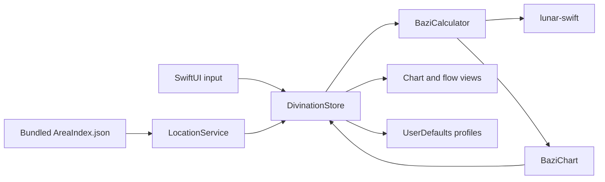

# Architecture / 架构

BaziChart is a SwiftPM macOS executable organized around a small observable store and immutable calculation results.

## Data Flow

## Modules

- `Models`: value types, calendar conversion, Four Pillars and flow calculations.
- `Services`: in-memory administrative-area search and longitude lookup.
- `Stores`: UI state, debounced generation, small result caches and local profiles.
- `Views`: desktop split-view interface and chart presentation.
- `Support`: colors, materials, animation and reusable view modifiers.

Calculations run in a detached task and publish the completed immutable chart on the main actor. A bounded cache avoids repeating the same chart work while editing or navigating.

## Persistence and Network

Profiles are encoded as JSON and stored in `UserDefaults`. The application has no runtime network client. SwiftPM accesses GitHub only while resolving source dependencies during development or CI.

## Packaging

`script/build_and_run.sh` builds the executable, copies its SwiftPM resource bundle, generates an `.icns` file, writes `Info.plist`, and verifies the resulting `.app`. The resource-bundle copy is required because `Bundle.module` must resolve `AreaIndex.json` outside the developer's build directory.

---

BaziChart 是一个 SwiftPM macOS 可执行项目。界面输入进入 `DivinationStore`，计算由后台任务调用 `BaziCalculator`，完成后一次性发布不可变的 `BaziChart`。地区数据随 App 打包，档案使用 `UserDefaults` 本地保存，运行时不访问网络。
